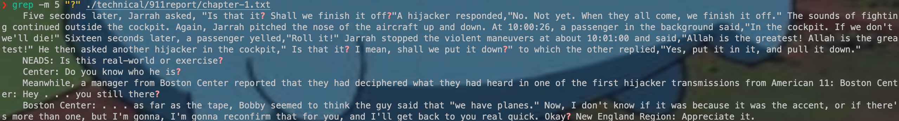
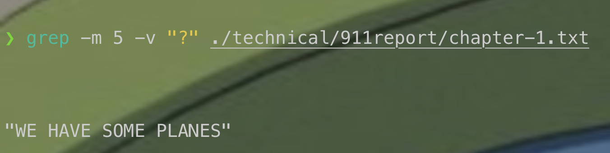
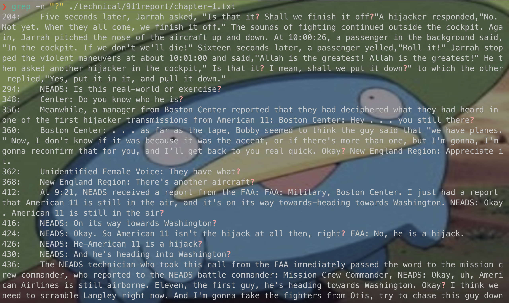
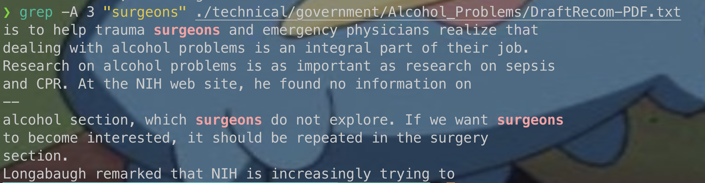
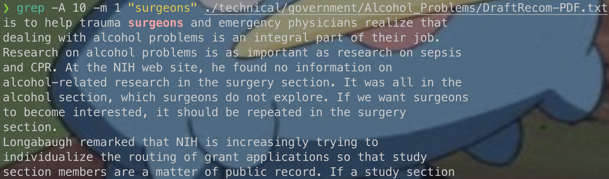

# CSE 15L Lab Report 3 Bugs and Commands (Week 5)

## Part 1 - Bugs
### Inputs
```java
import static org.junit.Assert.*;
import org.junit.*;

public class ArrayTests {
    @Test
    public void ArrayTests {
        @Test
        public void testReverseInPlace() {
            int[] input = { 3 };
            ArrayExamples.reverseInPlace(input1);
            assertArrayEquals(new int[] {3}, input1);
        }

        @Test
        public void testReverseInPlace2() {
            int[] input2 = {1, 2};
            ArrayExamples.reverseInPlace(input2);
            assertArrayEquals(new int[] {2, 1}, input2);
        }
    }
}
```
#### Non-Failure-Inducing
```java
@Test
public void testReverseInPlace() {
    int[] input = { 3 };
    ArrayExamples.reverseInPlace(input1);
    assertArrayEquals(new int[] {3}, input1);
}
```
#### Failure-Inducing

```java
@Test
public void testReverseInPlace2() {
    int[] input2 = {1, 2};
    ArrayExamples.reverseInPlace(input2);
    assertArrayEquals(new int[] {2, 1}, input2);
}
```

### Symptoms and Bugs
#### Symptoms
> The symptom, as the output of running the tests (provide it as a screenshot of running JUnit with at least the two inputs above)


#### Bugs (And Before-After)
**Before**
```java
public class ArrayExamples {
    // Changes the input array to be in reversed order
    static void reverseInPlace(int[] arr) {
        for(int i = 0; i < arr.length; i += 1) {
            arr[i] = arr[arr.length - i - 1];
        }
    }
}
```
**After**
```java
public class ArrayExamples {
    // Changes the input array to be in reversed order
    static void reverseInPlace(int[] arr) {
    int length = arr.length;
        for (int i = 0; i < length / 2; i += 1) {
            // arr[i] = arr[arr.length - i - 1];
            int temp = arr[i];
            arr[i] = arr[length - 1 - i];
            arr[length - 1 - i] = temp;
        }
    }
}
```

The bug happens because:

1. the code directly changes the content of the array elememt when reversing and
2. the code doesn't store a temporary variable when swapping, and
3. the code is looping through the entire array when it only needs to loop through the first half to swap it with the corresponding element of the second half.

The new version of the code fixes this issue because first, it only loops through the first half of the element to swap with the corresponding element in the other half that is to be swapped. This avoids the swapping of the element from happening 2 times, which might lead the swapping to be non-effective at all since it swaps them first but then swaps them back.

Next, it also initializes a new variable called `temp`. This prevents the original value of the element from being lost when it's swapped with another one.

## Part 2 - Researching Commands

### Outline
I'll be researching on the `grep` command. Here's the following command-line options I'll be trying out:

1. `-v`, `--invert-match`
2. `-m`, `--max-count`
3. `-n`
4. `-A num`, `--after-context=num`

> Note: I found these command-line options and descriptions from the description printed after typing `man grep` in my terminal.

#### `-v`, `--invert-match`
> Selected lines are those not matching any of the specified patterns

##### Example 1 
`grep -v "Area of Inquiry" ./technical/government/About_LSC/CONFIG_STANDARDS.txt`
In this file, we notice there're a lot of repeating lines with "Area of Inquiry"


Therefore, if we want to read the file without seeing the repeating "Area of Inquiry" line, we can use `grep -v "Area of Inquiry" ./technical/government/About_LSC/CONFIG_STANDARDS.txt`.

The command prints out all the lines in ./technical/government/About_LSC/CONFIG_STANDARDS.txt **EXCEPT** the lines that contain "Area of Inquiry".


##### Example 2
`grep -v "?" ./technical/911report/chapter-1.txt`
This 911 report records the conversation in a 911 call. 
If we only want to know what the person on the other end says, we can use the command above since it will exclude any line containing "?" (which very likely contains questions from the person at the 911 Call Center).


Since the text is too long to be represented on the screen, here's the segment of it. As we can see, the question mark "?"" has disappeared.

The command prints out all the lines in ./technical/911report/chapter-1.txt **EXCEPT** the lines with question mark "?".

#### `-m`, `--max-count`
> Stop reading the file after num matches.

##### Example 1
For the 911 files, if we think there's too many lines and we only want to see questions that happen in the first few lines of conversations, we can use the option `-m`.

For example, if we want to see the non-questions in the 
`grep -m 5 "?" ./technical/911report/chapter-1.txt`



The command looks through the file ./technical/911report/chapter-1.txt and printed out the first 5 matches of "?".

##### Example 2
For the 911 files, if we think there's too many lines and we only want to see non-questions that happen in the first few lines of conversations, we can combine option `-m` and `-v`.

`grep -m 5 -v "?" ./technical/911report/chapter-1.txt`


The command looks through the file ./technical/911report/chapter-1.txt, find the first 5 matches of the file that don't contain "?". In this case, it also contains the empty lines in the file.

#### `-n` pattern
> Each output line is preceded by its relative line number in the file, starting at line 1.
>              The line number counter is reset for each file processed.  This option is ignored if -c,
>              -L, -l, or -q is specified.

According to my understanding, this essentially also prints out the line number of the part that matches the pattern we're searching for

##### Example 1

`grep -n "planes" ./technical/911report/chapter-1.txt`



The command here prints out all matches of "planes" in ./technical/911report/chapter-1.txt with the line number of each match on the left. 


##### Example 2

`grep -n "New York City" ./technical/911report/chapter-10.txt`


The command here prints out all matches to "New York City" in the file ./technical/911report/chapter-10.txt, with the line number of each match on the left.

#### `-A num`, `--after-context=num`
> Print num lines of trailing context after each match. 

##### Example 1
`grep -A 3 "surgeons" ./technical/government/Alcohol_Problems/DraftRecom-PDF.txt`



In this case, it prints out all matches to the text "surgeon" while also printing out the 3 lines after them. 

##### Example 2 Combine `-A num` with `-m num`

If we only want to view one 
`grep -A 10 -m 1 "surgeons" ./technical/government/Alcohol_Problems/DraftRecom-PDF.txt`


In this case, it prints the first match to the word "surgeon" and also shows the 10 lines that are after the match.