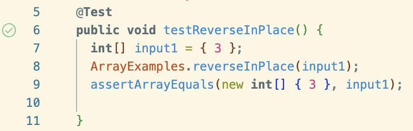
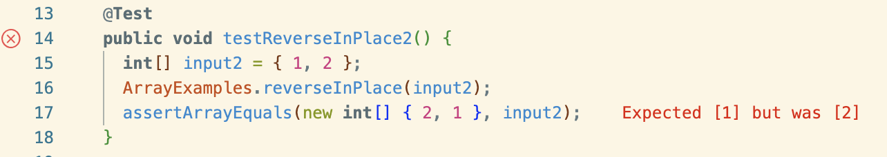

# CSE 15L Lab Report 3 Bugs and Commands (Week 5)

## Part 1 - Bugs
### Inputs
```java
import static org.junit.Assert.*;
import org.junit.*;

public class ArrayTests {
    @Test
    public void ArrayTests {
        @Test
        public void testReverseInPlace() {
            int[] input = { 3 };
            ArrayExamples.reverseInPlace(input1);
            assertArrayEquals(new int[] {3}, input1);
        }

        @Test
        public void testReverseInPlace2() {
            int[] input2 = {1, 2};
            ArrayExamples.reverseInPlace(input2);
            assertArrayEquals(new int[] {2, 1}, input2);
        }
    }
}
```
#### Non-Failure-Inducing
```java
@Test
public void testReverseInPlace() {
    int[] input = { 3 };
    ArrayExamples.reverseInPlace(input1);
    assertArrayEquals(new int[] {3}, input1);
}
```
#### Failure-Inducing

```java
@Test
public void testReverseInPlace2() {
    int[] input2 = {1, 2};
    ArrayExamples.reverseInPlace(input2);
    assertArrayEquals(new int[] {2, 1}, input2);
}
```

### Symptoms and Bugs
#### Symptoms
> The symptom, as the output of running the tests (provide it as a screenshot of running JUnit with at least the two inputs above)





#### Bugs (And Before-After)
**Before**
```java
public class ArrayExamples {
    // Changes the input array to be in reversed order
    static void reverseInPlace(int[] arr) {
        for(int i = 0; i < arr.length; i += 1) {
            arr[i] = arr[arr.length - i - 1];
        }
    }
}
```
**After**
```java
public class ArrayExamples {
    // Changes the input array to be in reversed order
    static void reverseInPlace(int[] arr) {
    int length = arr.length;
        for (int i = 0; i < length / 2; i += 1) {
            // arr[i] = arr[arr.length - i - 1];
            int temp = arr[i];
            arr[i] = arr[length - 1 - i];
            arr[length - 1 - i] = temp;
        }
    }
}
```

The bug happens because:

1. the code directly changes the content of the array elememt when reversing and
2. the code doesn't store a temporary variable when swapping, and
3. the code is looping through the entire array when it only needs to loop through the first half to swap it with the corresponding element of the second half.

The new version of the code fixes this issue because first, it only loops through the first half of the element to swap with the corresponding element in the other half that is to be swapped. This avoids the swapping of the element from happening 2 times, which might lead the swapping to be non-effective at all since it swaps them first but then swaps them back.

Next, it also initializes a new variable called `temp`. This prevents the original value of the element from being lost when it's swapped with another one.

## Part 2 - Researching Commands

### Outline
I'll be researching on the `grep` command. Here's the following command-line options I'll be trying out:

1. `-c`, `--count` 
2. `-m`, `--max-count`
3. `-R`
4. `-A num`, `--after-context=num`

> Note: I found these command-line options and descriptions from the description printed after typing `man grep` in my terminal.

#### `-c`, `--count` 

> **Displaying the count of number of matches** : We can find the number of lines that matches the given string/pattern Source: [GeeksForGeeks](https://www.geeksforgeeks.org/grep-command-in-unixlinux/#)

##### Example 1 

The command will be convenient when we're trying to find the files that matches the topics we want.

For example, if we want to search through government reports about a specific topic, such as "alcohol," we can use the `-l` command since it shows all the files containing the text "alcohol."

To do that, we can use the command `grep -il "alcohol" ./technical/government/*/*`. Combining `-i` that matches the words case-insensitive and `-l` that prints out the matching files instead of the matching lines, we can search through all the files in the government subdirectories and see the files that contains the keyword "Alcohol." This will be useful when we're trying to search for journals containing a specific keyword and thus useful for research and literature reviews.

```
Alcohol_Problems/DraftRecom-PDF.txt
Alcohol_Problems/Session2-PDF.txt
Alcohol_Problems/Session3-PDF.txt
Alcohol_Problems/Session4-PDF.txt
Gen_Account_Office/og97002.txt
Gen_Account_Office/pe1019.txt
Media/Abuse_penalties.txt
Media/Annual_Fee.txt
Media/Higher_Registration_Fees.txt
Media/Paralegal_Honored.txt
Media/Weak_economy.txt
```

##### Example 2
Similarly, we can use the command `grep -il "Anemia" ./technical/biomed/*` to fetch all the Biomed journal files contianing the word "Anemia" through case-insensitive searching. The following files were returned.

```
./technical/biomed/1471-2091-3-8.txt
./technical/biomed/1471-2202-3-3.txt
./technical/biomed/1471-230X-1-8.txt
./technical/biomed/1471-2326-2-4.txt
./technical/biomed/1471-2350-2-12.txt
./technical/biomed/1471-2350-3-1.txt
./technical/biomed/1471-2350-4-6.txt
./technical/biomed/1471-2369-3-9.txt
./technical/biomed/1471-2407-2-23.txt
./technical/biomed/1471-2407-2-9.txt
./technical/biomed/1472-6874-2-8.txt
./technical/biomed/1472-6947-3-8.txt
./technical/biomed/ar383.txt
./technical/biomed/cc1044.txt
./technical/biomed/cc105.txt
./technical/biomed/cc343.txt
./technical/biomed/gb-2001-2-6-research0021.txt
./technical/biomed/gb-2001-2-7-research0024.txt
```

#### `-m`, `--max-count`
> Stop reading the file after num matches.
Source: [Linux manual page](https://man7.org/linux/man-pages/man1/grep.1.html)

##### Example 1
The 911 technical reports contain how different sectors communicated with each other during the incident, including the air-traffic controller "Boston Center." To view the first 5 of what the Boston Center said to other Air-traffic Control Center, we can use the option `-m`.

This command shows the first 5 occurences of "Boston Center:" in Chapter 1: `grep -m 5 "Boston Center:" ./technical/911report/chapter-1.txt`. This is useful for us to view what the Boston Aircraft Control Center said to other people/center on phone.

```
    Meanwhile, a manager from Boston Center reported that they had deciphered what they had heard in one of the first hijacker transmissions from American 11: Boston Center: Hey . . . you still there?
    Boston Center: . . . as far as the tape, Bobby seemed to think the guy said that "we have planes." Now, I don't know if it was because it was the accent, or if there's more than one, but I'm gonna, I'm gonna reconfirm that for you, and I'll get back to you real quick. Okay? New England Region: Appreciate it.
    Boston Center: Planes, as in plural.
    Boston Center: It sounds like, we're talking to New York, that there's another one aimed at the World Trade Center.
    Boston Center: A second one just hit the Trade Center. 
```

##### Example 2
For the PLOS journals, we can use `grep` to find all the instances when the journal article mentioned about "Latin America".

`grep -im 5 "Taiwan" technical/plos/*.txt`

Here we used `-i` and `-m`.
`-i` helped make search case insensitive.
`-m` specified the maximum count of occurences it'll be showing.

Thus, this command uses case insensitive search to search for the first 5 occurences of "Taiwan" of the text files in the directory `technical/plos`.

This will be useful when we're interested in finding Biology research related to "Taiwan", specifically the lines that we should be looking for within different paper.

```
technical/plos/journal.pbio.0020113.txt: monitoring programs. “With the recent expansion of the Taiwanese and Chinese fleets, we
```

#### `-iR` pattern
> -i to search for a string case insensitively
> -R to recursively check all the files in the directory.
> Source: [GeeksForGeeks](https://www.geeksforgeeks.org/grep-command-in-unixlinux/)

To my understanding, this essentially also prints out the line number of the part that matches the pattern we're searching for

##### Example 1

`grep -iR Isotopic ./technical/biomed/`

```
./technical/biomed//1471-2202-3-16.txt:          Isotopic in situHybridization
./technical/biomed//1471-2202-3-16.txt:          Isotopic-
```

The command here prints out all case-insensitive matches (achieved through `-i`) of "Isotopic" in the directory `./technical/biomed/` (achieved through `-R`, which recursively check all the files in the directory).

This is useful when we're trying to research on the term "Isotopic" by seeing where it appears in BioMed Scientific Journals. 

##### Example 2

`grep -iR "zebrafish BDNF" technical/biomed/`

```
technical/biomed//1471-2202-4-11.txt:        zebrafish BDNF gene. The mammalian BDNF gene is known to
technical/biomed//1471-2202-4-11.txt:        We previously cloned a zebrafish BDNF transcript that
technical/biomed//1471-2202-4-11.txt:        organizations [ 4 ] . We recently cloned the zebrafish BDNF
technical/biomed//1471-2202-4-11.txt:          The zebrafish BDNF gene has at least four 5'
technical/biomed//1471-2202-4-11.txt:          that the zebrafish BDNF gene would have multiple 5'
technical/biomed//1471-2202-4-11.txt:          zebrafish BDNF gene.
technical/biomed//1471-2202-4-11.txt:          zebrafish BDNF gene (figure 3).
technical/biomed//1471-2202-4-11.txt:          the mammalian or zebrafish BDNF genes. A BLAST search
technical/biomed//1471-2202-4-11.txt:          HindIII map of the zebrafish BDNF gene (see figure
technical/biomed//1471-2202-4-11.txt:          comparison data suggest that the zebrafish BDNF gene has
technical/biomed//1471-2202-4-11.txt:        that the zebrafish BDNF gene promoters are also expressed
technical/biomed//1471-2202-4-11.txt:        The zebrafish BDNF gene is much more compact than the
```

The command here prints out all the case insensitive occurrences (achieved through `-i` which specifies case-insensitive search) of "zebrafish BDNF" in the directory `technical/biomed/` (achieved through recursive search as specified by `-R`).

This is useful when we're interested in Zebrafish's BDNF gene and we want to look through all the occurences where the Biomed journals talk about it.

#### `-A num`, `--after-context=num`
> Print num lines of trailing context after each match. 
> Source: [Linux manual page](https://man7.org/linux/man-pages/man1/grep.1.html)

##### Example 1
`grep -A 3 "surgeons" ./technical/government/Alcohol_Problems/DraftRecom-PDF.txt`

```
is to help trauma surgeons and emergency physicians realize that
dealing with alcohol problems is an integral part of their job.
Research on alcohol problems is as important as research on sepsis
and CPR. At the NIH web site, he found no information on
--
alcohol section, which surgeons do not explore. If we want surgeons
to become interested, it should be repeated in the surgery
section.
Longabaugh remarked that NIH is increasingly trying to
```

In this case, it prints out all matches to the text "surgeon" while also printing out the 3 lines after them. 

Since the file `./technical/government/Alcohol_Problems/DraftRecom-PDF.txt` is about recommendations to dealing with alcohol problems by making different kinds of doctors care about the issue, the search for "surgeons" within the file would help us understand how it plans to engage surgeons.

For example, within the first result, the text suggested to make surgeons realize that "alcohol problems is an integral part of their job."

##### Example 2 Combine `-A num` with `-m num`

If we only want to view one 
`grep -A 10 -m 1 "surgeons" ./technical/government/Alcohol_Problems/DraftRecom-PDF.txt`

This command only shows the first occurence of "surgeons" in the file `./technical/government/Alcohol_Problems/DraftRecom-PDF.txt` but shows both the occurence and the 10 lines after that occurence.

```
is to help trauma surgeons and emergency physicians realize that
dealing with alcohol problems is an integral part of their job.
Research on alcohol problems is as important as research on sepsis
and CPR. At the NIH web site, he found no information on
alcohol-related research in the surgery section. It was all in the
alcohol section, which surgeons do not explore. If we want surgeons
to become interested, it should be repeated in the surgery
section.
Longabaugh remarked that NIH is increasingly trying to
individualize the routing of grant applications so that study
section members are a matter of public record. If a study section
```

In this case, it prints the first match to the word "surgeon" and also shows the 10 lines that are after the match. This is useful in this case because the 10 lines give us more context and thus would help us understand more on how the text is planning on engaging surgeons to solving alcohol problems.