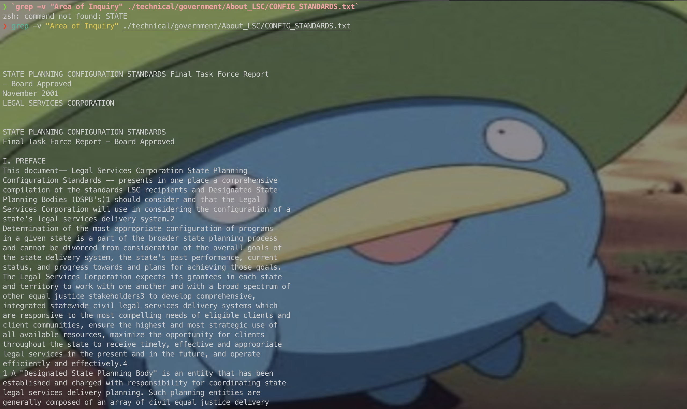

# CSE 15L Lab Report 3 Bugs and Commands (Week 5)

## Part 1 - Bugs
### Inputs
```java
import static org.junit.Assert.*;
import org.junit.*;

public class ArrayTests {
    @Test
    public void ArrayTests {
        @Test
        public void testReverseInPlace() {
            int[] input = { 3 };
            ArrayExamples.reverseInPlace(input1);
            assertArrayEquals(new int[] {3}, input1);
        }

        @Test
        public void testReverseInPlace2() {
            int[] input2 = {1, 2};
            ArrayExamples.reverseInPlace(input2);
            assertArrayEquals(new int[] {2, 1}, input2);
        }
    }
}
```
#### Non-Failure-Inducing
```java
@Test
public void testReverseInPlace() {
    int[] input = { 3 };
    ArrayExamples.reverseInPlace(input1);
    assertArrayEquals(new int[] {3}, input1);
}
```
#### Failure-Inducing

```java
@Test
public void testReverseInPlace2() {
    int[] input2 = {1, 2};
    ArrayExamples.reverseInPlace(input2);
    assertArrayEquals(new int[] {2, 1}, input2);
}
```

### Symptoms and Bugs
#### Symptoms
> The symptom, as the output of running the tests (provide it as a screenshot of running JUnit with at least the two inputs above)


#### Bugs (And Before-After)
**Before**
```java
public class ArrayExamples {
    // Changes the input array to be in reversed order
    static void reverseInPlace(int[] arr) {
        for(int i = 0; i < arr.length; i += 1) {
            arr[i] = arr[arr.length - i - 1];
        }
    }
}
```
**After**
```java
public class ArrayExamples {
    // Changes the input array to be in reversed order
    static void reverseInPlace(int[] arr) {
    int length = arr.length;
        for (int i = 0; i < length / 2; i += 1) {
            // arr[i] = arr[arr.length - i - 1];
            int temp = arr[i];
            arr[i] = arr[length - 1 - i];
            arr[length - 1 - i] = temp;
        }
    }
}
```

The bug happens because:

1. the code directly changes the content of the array elememt when reversing and
2. the code doesn't store a temporary variable when swapping, and
3. the code is looping through the entire array when it only needs to loop through the first half to swap it with the corresponding element of the second half.

The new version of the code fixes this issue because first, it only loops through the first half of the element to swap with the corresponding element in the other half that is to be swapped. This avoids the swapping of the element from happening 2 times, which might lead the swapping to be non-effective at all since it swaps them first but then swaps them back.

Next, it also initializes a new variable called `temp`. This prevents the original value of the element from being lost when it's swapped with another one.

## Part 2 - Researching Commands

### Outline
I'll be researching on the `grep` command. Here's the following command-line options I'll be trying out:

1. `-v`, `--invert-match`
2. `-m`, `--max-count`
3. `-n`
4. `-A num`, `--after-context=num`

> Note: I found these command-line options and descriptions from the description printed after typing `man grep` in my terminal.

#### `-v`, `--invert-match`
> Selected lines are those not matching any of the specified patterns

##### Example 1 
`grep -v "Area of Inquiry" ./technical/government/About_LSC/CONFIG_STANDARDS.txt`
In this file, we notice there're a lot of repeating lines with "Area of Inquiry"


Therefore, if we want to read the file without seeing the repeating "Area of Inquiry" line, we can use `grep -v "Area of Inquiry" ./technical/government/About_LSC/CONFIG_STANDARDS.txt`.

The command prints out all the lines in ./technical/government/About_LSC/CONFIG_STANDARDS.txt **EXCEPT** the lines that contain "Area of Inquiry".


##### Example 2
`grep -v "?" ./technical/911report/chapter-1.txt`
This 911 report records the conversation in a 911 call. 
If we only want to know what the person on the other end says, we can use the command above since it will exclude any line containing "?" (which very likely contains questions from the person at the 911 Call Center).


Since the text is too long to be represented on the screen, here's the segment of it. As we can see, the question mark "?"" has disappeared.

The command prints out all the lines in ./technical/911report/chapter-1.txt **EXCEPT** the lines with question mark "?".

#### `-m`, `--max-count`
> Stop reading the file after num matches.

##### Example 1
For the 911 files, if we think there's too many lines and we only want to see questions that happen in the first few lines of conversations, we can use the option `-m`.

For example, if we want to see the non-questions in the 
`grep -m 5 "?" ./technical/911report/chapter-1.txt`

```
    Five seconds later, Jarrah asked, "Is that it? Shall we finish it off?"A hijacker responded,"No. Not yet. When they all come, we finish it off." The sounds of fighting continued outside the cockpit. Again, Jarrah pitched the nose of the aircraft up and down. At 10:00:26, a passenger in the background said,"In the cockpit. If we don't we'll die!" Sixteen seconds later, a passenger yelled,"Roll it!" Jarrah stopped the violent maneuvers at about 10:01:00 and said,"Allah is the greatest! Allah is the greatest!" He then asked another hijacker in the cockpit," Is that it? I mean, shall we put it down?" to which the other replied,"Yes, put it in it, and pull it down."
    NEADS: Is this real-world or exercise?
    Center: Do you know who he is?
    Meanwhile, a manager from Boston Center reported that they had deciphered what they had heard in one of the first hijacker transmissions from American 11: Boston Center: Hey . . . you still there?
    Boston Center: . . . as far as the tape, Bobby seemed to think the guy said that "we have planes." Now, I don't know if it was because it was the accent, or if there's more than one, but I'm gonna, I'm gonna reconfirm that for you, and I'll get back to you real quick. Okay? New England Region: Appreciate it.
```

The command looks through the file ./technical/911report/chapter-1.txt and printed out the first 5 matches of "?".

##### Example 2
For the 911 files, if we think there's too many lines and we only want to see non-questions that happen in the first few lines of conversations, we can combine option `-m` and `-v`.

`grep -m 5 -v "?" ./technical/911report/chapter-1.txt`

```
"WE HAVE SOME PLANES"
```

The command looks through the file ./technical/911report/chapter-1.txt, find the first 5 matches of the file that don't contain "?". In this case, it also contains the empty lines in the file.

#### `-n` pattern
> Each output line is preceded by its relative line number in the file, starting at line 1.
>              The line number counter is reset for each file processed.  This option is ignored if -c,
>              -L, -l, or -q is specified.

According to my understanding, this essentially also prints out the line number of the part that matches the pattern we're searching for

##### Example 1

`grep -n "planes" ./technical/911report/chapter-1.txt`

```
They were planning to hijack these planes and turn them into large guided missiles, loaded with up to 11,400 gallons of jet fuel. By 8:00 A.M. on the morning of Tuesday, September 11,2001, they had defeated all the security layers that America's civil aviation security system then had in place to prevent a hijacking. The Hijacking of American 11 American Airlines Flight 11 provided nonstop service from Boston to Los Angeles. On September 11, Captain John Ogonowski and First Officer Thomas McGuinness piloted the Boeing 767. It carried its full capacity of nine flight attendants. Eighty-one passengers boarded the flight with them (including the five terrorists).22 The plane took off at 7:59. Just before 8:14, it had climbed to 26,000 feet, not quite its initial assigned cruising altitude of 29,000 feet. All communications and flight profile data were normal. About this time the "Fasten Seatbelt" sign would usually have been turned off and the flight attendants would have begun preparing for cabin service.
154:    At the same time, Boston Center realized that a message transmitted just before 8:25 by the hijacker pilot of American 11 included the phrase, "We have some planes."
160:    Several FAA air traffic control officials told us it was the air carriers' responsibility to notify their planes of security problems. One senior FAA air traffic control manager said that it was simply not the FAA's place to order the airlines what to tell their pilots.
222:    Controllers track airliners such as the four aircraft hijacked on 9/11 primarily by watching the data from a signal emitted by each aircraft's transponder equipment. Those four planes, like all aircraft traveling above 10,000 feet, were required to emit a unique transponder signal while in flight.
226:    Before 9/11, it was not unheard of for a commercial aircraft to deviate slightly from its course, or for an FAA controller to lose radio contact with a pilot for a short period of time. A controller could also briefly lose a commercial aircraft's transponder signal, although this happened much less frequently. However, the simultaneous loss of radio and transponder signal would be a rare and alarming occurrence, and would normally indicate a catastrophic system failure or an aircraft crash. In all of these instances, the job of the controller was to reach out to the aircraft, the parent company of the aircraft, and other planes in the vicinity in an attempt to reestablish communications and set the aircraft back on course. Alarm bells would not start ringing until these efforts-which could take five minutes or more-were tried and had failed.
272:    At 8:24:38, the following transmission came from American 11: American 11: We have some planes. Just stay quiet, and you'll be okay. We are returning to the airport.
274:    The controller only heard something unintelligible; he did not hear the specific words "we have some planes." The next transmission came seconds later: American 11: Nobody move. Everything will be okay. If you try to make any moves, you'll endanger yourself and the airplane. Just stay quiet.
360:    Boston Center: . . . as far as the tape, Bobby seemed to think the guy said that "we have planes." Now, I don't know if it was because it was the accent, or if there's more than one, but I'm gonna, I'm gonna reconfirm that for you, and I'll get back to you real quick. Okay? New England Region: Appreciate it.
374:    Boston Center immediately advised the New England Region that it was going to stop all departures at airports under its control. At 9:05, Boston Center confirmed for both the FAA Command Center and the New England Region that the hijackers aboard American 11 said "we have planes." At the same time, New York Center declared "ATC zero"-meaning that aircraft were not permitted to depart from, arrive at, or travel through New York Center's airspace until further notice.
404:    By 9:25, FAA's Herndon Command Center and FAA headquarters knew two aircraft had crashed into the World Trade Center. They knew American 77 was lost. At least some FAA officials in Boston Center and the New England Region knew that a hijacker on board American 11 had said "we have some planes." Concerns over the safety of other aircraft began to mount. A manager at the Herndon Command Center asked FAA headquarters if they wanted to order a "nationwide ground stop." While this was being discussed by executives at FAA headquarters, the Command Center ordered one at 9:25.
434:    The mention of a "third aircraft" was not a reference to American 77. There was confusion at that moment in the FAA. Two planes had struck the World Trade Center, and Boston Center had heard from FAA headquarters in Washington that American 11 was still airborne. We have been unable to identify the source of this mistaken FAA information.
448:    Right after the Pentagon was hit, NEADS learned of another possible hijacked aircraft. It was an aircraft that in fact had not been hijacked at all. After the second World Trade Center crash, Boston Center managers recognized that both aircraft were transcontinental 767 jetliners that had departed Logan Airport. Remembering the "we have some planes" remark, Boston Center guessed that Delta 1989 might also be hijacked. Boston Center called NEADS at 9:41 and identified Delta 1989, a 767 jet that had left Logan Airport for Las Vegas, as a possible hijack. NEADS warned the FAA's Cleveland Center to watch Delta 1989. The Command Center and FAA headquarters watched it too. During the course of the morning, there were multiple erroneous reports of hijacked aircraft. The report of American 11 heading south was the first; Delta 1989 was the second.
546:    In fact, not only was the scramble prompted by the mistaken information about American 11, but NEADS never received notice that American 77 was hijacked. It was notified at 9:34 that American 77 was lost. Then, minutes later, NEADS was told that an unknown plane was 6 miles southwest of the White House. Only then did the already scrambled airplanes start moving directly toward Washington, D.C.
628:    The Secret Service logged Mrs. Cheney's arrival at the White House at 9:52, and she joined her husband in the tunnel. According to contemporaneous notes, at 9:55 the Vice President was still on the phone with the President advising that three planes were missing and one had hit the Pentagon. We believe this is the same call in which the Vice President urged the President not to return to Washington. After the call ended, Mrs. Cheney and the Vice President moved from the tunnel to the shelter conference room.
706:    There is no evidence that NORAD headquarters or military officials in the NMCC knew-during the morning of September 11-that the Andrews planes were airborne and operating under different rules of engagement.
716:    First, the Langley pilots were never briefed about the reason they were scrambled. As the lead pilot explained, "I reverted to the Russian threat. . . . I'm thinking cruise missile threat from the sea. You know you look down and see the Pentagon burning and I thought the bastards snuck one by us. . . . [Y]ou couldn't see any airplanes, and no one told us anything." The pilots knew their mission was to divert aircraft, but did not know that the threat came from hijacked airliners.
```
The command here prints out all matches of "planes" in ./technical/911report/chapter-1.txt with the line number of each match on the left. 


##### Example 2

`grep -n "New York City" ./technical/911report/chapter-10.txt`

```
85:                    provide $20 billion for New York City, in addition to the $20 billion his budget
```

The command here prints out all matches to "New York City" in the file ./technical/911report/chapter-10.txt, with the line number of each match on the left.

#### `-A num`, `--after-context=num`
> Print num lines of trailing context after each match. 

##### Example 1
`grep -A 3 "surgeons" ./technical/government/Alcohol_Problems/DraftRecom-PDF.txt`

```
is to help trauma surgeons and emergency physicians realize that
dealing with alcohol problems is an integral part of their job.
Research on alcohol problems is as important as research on sepsis
and CPR. At the NIH web site, he found no information on
--
alcohol section, which surgeons do not explore. If we want surgeons
to become interested, it should be repeated in the surgery
section.
Longabaugh remarked that NIH is increasingly trying to
```

In this case, it prints out all matches to the text "surgeon" while also printing out the 3 lines after them. 

##### Example 2 Combine `-A num` with `-m num`

If we only want to view one 
`grep -A 10 -m 1 "surgeons" ./technical/government/Alcohol_Problems/DraftRecom-PDF.txt`

```
is to help trauma surgeons and emergency physicians realize that
dealing with alcohol problems is an integral part of their job.
Research on alcohol problems is as important as research on sepsis
and CPR. At the NIH web site, he found no information on
alcohol-related research in the surgery section. It was all in the
alcohol section, which surgeons do not explore. If we want surgeons
to become interested, it should be repeated in the surgery
section.
Longabaugh remarked that NIH is increasingly trying to
individualize the routing of grant applications so that study
section members are a matter of public record. If a study section
```

In this case, it prints the first match to the word "surgeon" and also shows the 10 lines that are after the match.