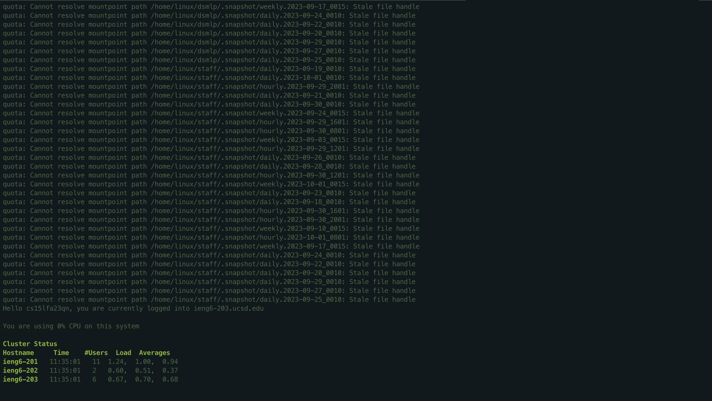
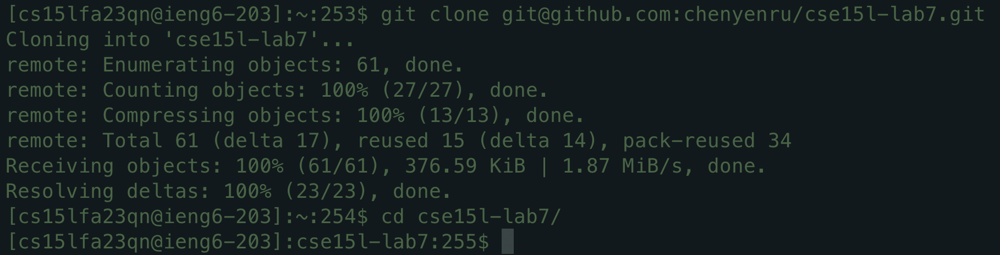
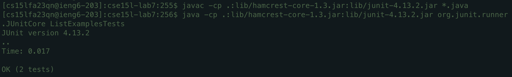
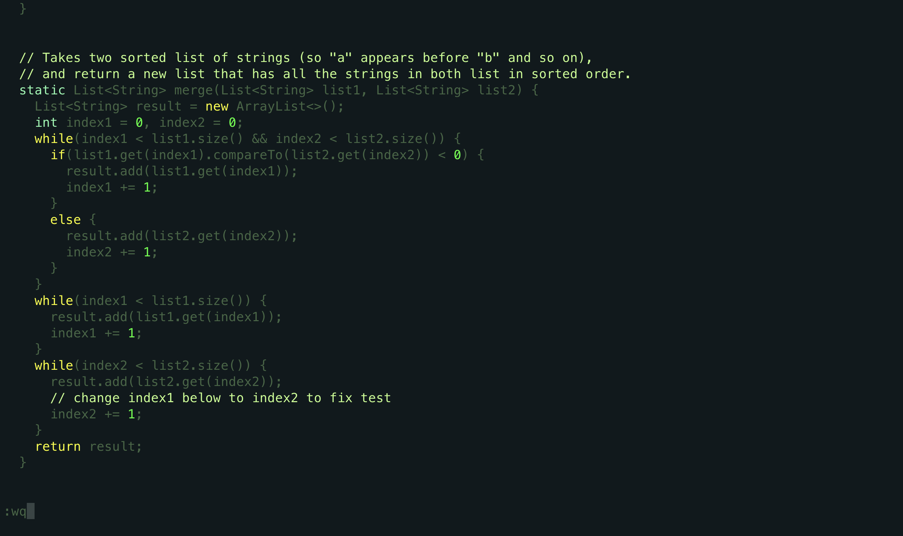
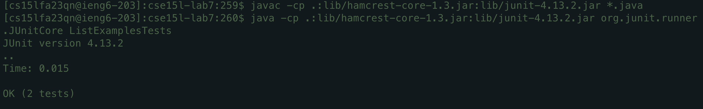
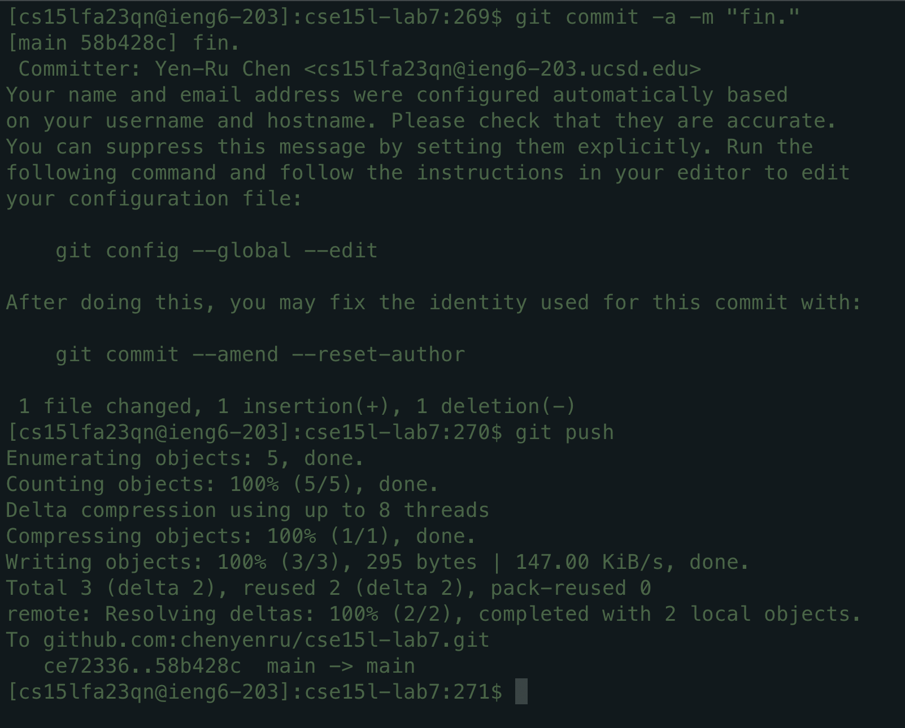

# Lab Report 4 - Vim (Week 7)
## First Try (for my own use)
`:%s/index1/index2/gc`
`:%s/sc/checker/g`


javac -cp .:lib/hamcrest-core-1.3.jar:lib/junit-4.13.2.jar *.java
java -cp .:lib/hamcrest-core-1.3.jar:lib/junit-4.13.2.jar org.junit.runner.JUnitCore ListExamplesTests

```bash
JUnit version 4.13.2
..E
Time: 0.551
There was 1 failure:
1) testMerge2(ListExamplesTests)
org.junit.runners.model.TestTimedOutException: test timed out after 500 milliseconds
	at ListExamples.merge(ListExamples.java:44)
	at ListExamplesTests.testMerge2(ListExamplesTests.java:19)

FAILURES!!!
Tests run: 2,  Failures: 1
```

## Sped up version (For Lab Report 4)

> 4. Log into ieng6


Keys pressed: 
1. `<Ctrl-R> ssh <tab> <ENTER>` because I've already `SSH` log in to the remote desktop before, and the CSE desktop is the only one I've SSH login into. So I get `ssh cs15lfa23qn@ieng6.ucsd.edu` command.


> 5. Clone your fork of the repository from your Github account (using the SSH URL)


Keys pressed: 
1. `<Ctrl-R> git clone <tab> <ENTER>` because I've cloned the same repo already for my base run, and the repo is the one I cloned most recently. So I get `git clone git@github.com:chenyenru/cse15l-lab7.git` command
2. Then, I pressed `cd cse <tab> <ENTER>` because out of all the directories in the remote desktop, only `cse15l-lab7` has `cse` as its first 3 characters. So I get `cd cse15l-lab7/` command.


> 6. Run the tests, demonstrating that they fail



Keys pressed: 
1. `<Ctrl-R> java <ENTER>` because I've run `javac` with the same `lib` path before, so I get `javac -cp .:lib/hamcrest-core-1.3.jar:lib/junit-4.13.2.jar *.java` command.
2. `<Ctrl-R> java -cp <ENTER>`. This is similar to the previous one. However, this time I typed in `java ` specifically because in the previous command, I typed in `javac`. Thus, if I only reverse search with `java`, the most recent command that would pop up would be `javac -cp .:lib/hamcrest-core-1.3.jar:lib/junit-4.13.2.jar *.java`, which is not what I want. Therefore, the space after `java` that gives `java ` successfully distinguishes it from `javac`, giving me command `java -cp .:lib/hamcrest-core-1.3.jar:lib/junit-4.13.2.jar org.junit.runner.JUnitCore ListExamplesTest`. 

> 7. Edit the code file ListExamples.java to fix the failing test (as a reminder, the error in the code is just that index1 is used instead of index2 in the final loop in merge)



Keys pressed:
1. `vim L<tab>.<tab><ENTER>`. The first `<tab>` autocompletes to `vim ListExamples` because that is the shared part of all the filenames that start with `L`. I included a dot `.` after the first tab to differentiate from `ListExamplesTest` and the class file `ListExamples`. Then, the second `<tab>` autocompletes the `java` and makes the command `vim ListExamples.java`. Then, I pressed `<ENTER>` to run the command.
2. `?index1 <ENTER>` because the `index1` that needs to be changed to `index2` is at the last occurence of `index1`. Therefore, I used backword word search command `?` to search for `index1`. The command moves the cursor to the first character of the last occurence of `index1`.
3. `e` moves the cursor to the last character of the word `index1`, which is `1`.
4. `r2` replaces the character the cursor is on with `2`. In this case, since we've moved our cursor to `1`, we changed the `1` of `index1` to `2`, therefore giving us `index2`. Since our goal is to change the `index1` at `merge()` to `index2`, we're done! Also, since `r` only changes one character, after it changes `1` to `2`, it automatically let us return to `NORMAL` mode.
5. `:wq <ENTER>` to write the new change to `ListExamples.java` and quit the Vim view.

*Note that the screenshot is what the terminal looks like before pressing `<ENTER>` of `:wq <ENTER>`. And that is for demonstration purpose. To show what `ListExamples.java` looks like.*

> 8. Run the tests, demonstrating that they now succeed



1. `<up><up><up><up><ENTER>` to run `javac -cp .:lib/hamcrest-core-1.3.jar:lib/junit-4.13.2.jar *.java` because the command is 4 up in the search history
2. Then `<up><up><up><up><ENTER>` again to run `java -cp .:lib/hamcrest-core-1.3.jar:lib/junit-4.13.2.jar org.junit.runner.JUnitCore ListExamplesTests` because now this command is 4 up in the search history (after executing the previous command for compiling java code)

> 9. Commit and push the resulting change to your Github account



1. `git commit -a -m "fin." <ENTER>` to stage and commit all the modified files with *commit message* "fin.".
2. `git push <ENTER>` to push all the committed changes to the remote repository
