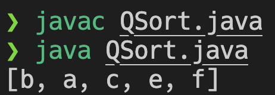
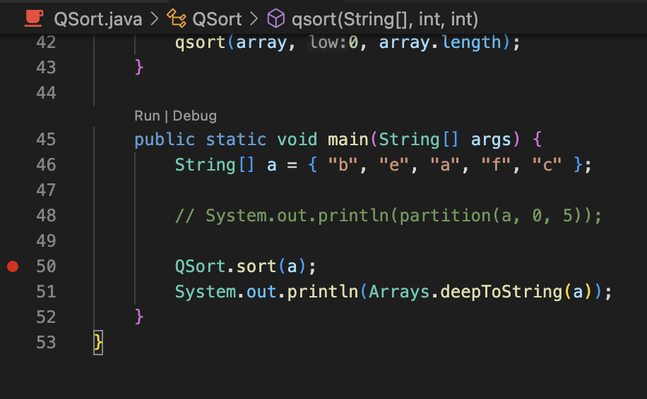
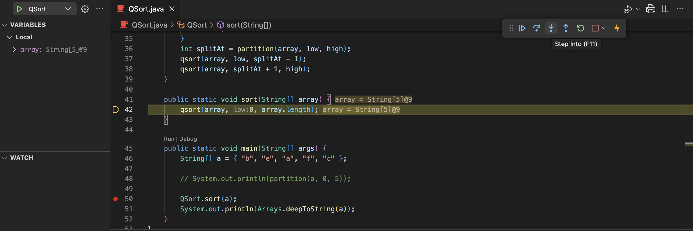
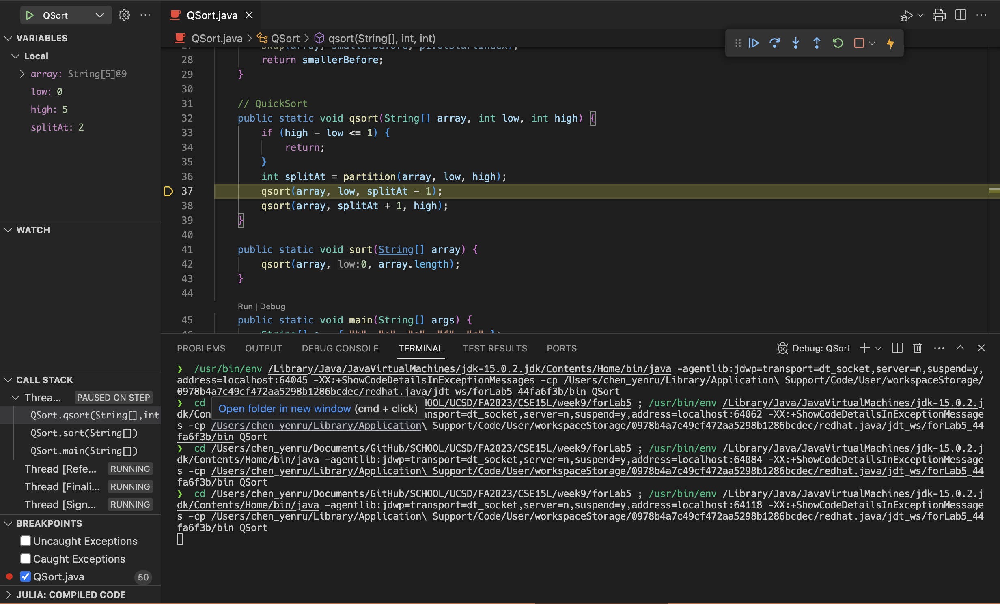
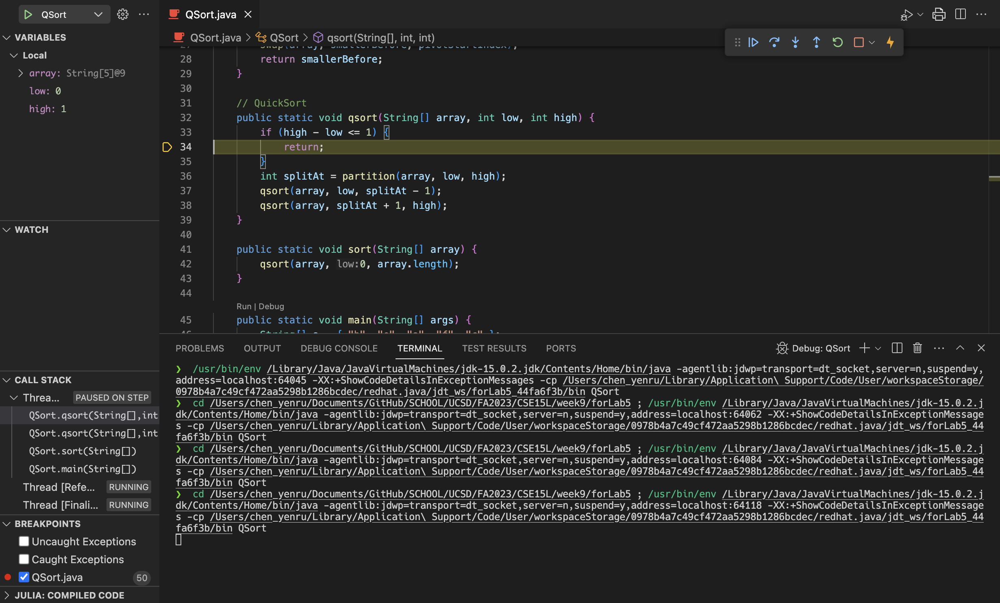
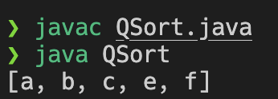

# Lab Report 5 - Putting it All Together (Week 9)

## Student's Post
> 1. The original post from a student with a screenshot showing a symptom and a description of a guess at the bug/some sense of what the failure-inducing input is. (Don’t actually make the post! Just write the content that would go in such a post)

**Title**: Weird Quick Sort Behavior

**Body**:

Hi, so I've been trying to debug my quicksort but it seems to be very problematic.

Below is my code:

```java
import java.util.Arrays;

// Adapted from CSE12 Prelecture Material Sort.java
// https://github.com/ucsd-cse12-f23/ucsd-cse12-f23.github.io/blob/d89c9b8917d799cd51f9531a92a8c3e0ef6574f7/_pre-lectures/lecture-13/Sort.java#L28

public class QSort {
    public static void swap(String[] array, int i1, int i2) {
        String temp = array[i2];
        array[i2] = array[i1];
        array[i1] = temp;
    }

    public static int partition(String[] array, int low, int high) {
        int pivotStartIndex = high - 1;
        String pivot = array[pivotStartIndex];
        int smallerBefore = low, largerAfter = high - 2;

        while (smallerBefore <= largerAfter) {
            if (array[smallerBefore].compareTo(pivot) < 0) {
                smallerBefore += 1;
            } else {
                swap(array, smallerBefore, largerAfter);
                largerAfter -= 1;
            }
        }

        swap(array, smallerBefore, pivotStartIndex);
        return smallerBefore;
    }

    // QuickSort
    public static void qsort(String[] array, int low, int high) {
        if (high - low <= 1) {
            return;
        }
        int splitAt = partition(array, low, high);
        qsort(array, low, splitAt - 1);
        qsort(array, splitAt + 1, high);
    }

    public static void sort(String[] array) {
        qsort(array, 0, array.length);
    }

    public static void main(String[] args) {
        String[] a = { "b", "e", "a", "f", "c" };

        // System.out.println(partition(a, 0, 5));

        QSort.sort(a);
        System.out.println(Arrays.deepToString(a));
    }
}
```

In my `main` method, I passed in the String Array `[ "b", "e", "a", "f", "c" ]`. I expected my QuickSort to sort and have the sorted array `["a", "b", "c", "e", "f"]`. However, when I ran my program with the following command:

```bash
javac QSort.java
java QSort
```

The following was printed out `[b, a, c, e, f]`



I have checked my QuickSort algorithm, but I still can't find the problem. 

I feel like there might be a problem with my recursive use of `qsort`. However, I'm a bit stuck on the concept since I'm still unfamiliar with `qsort` and just Quick Sort algorithm in general. What should I look into and where should I start?

## TA's Response

> 2. A response from a TA asking a leading question or suggesting a command to try (To be clear, you are mimicking a TA here.)

Hi, thank you for reaching out, and kudos for including your failure-inducing-input and thought process. I'd say you're already ahead!

For your concerns, I would recommend you doing two things. One is related to the use of debugger. And the other is related to refreshing your understanding on Quick Sort.

Assuming you're using VSCode, I recommend you to look into [VSCode's Official Documentation on Using Java Debugger](https://code.visualstudio.com/docs/java/java-debugging#_debugging-single-files).

When reading the documentation, take note of the following:
1. What is breakpoint?
2. How do I start a debugging session?
3. What is step over, step in, step out? How do I access these functions in the VSCode Interface
4. And finally: which line in my `main` method should I set the breakpoint at? What am I looking for

This will work in handy when you're trying to debug.

Next, your intuition for where the bug is are right. The most important thing is to look into

I recommend [GeeksForGeeks's article on Quick Sort](https://www.geeksforgeeks.org/quick-sort/). Look specifically at the section "Illustration of Quicksort". It will give you a better understanding on what partitioning around a pivot means.

Another thing is to take note of the bound you set for the argument `low` and `high` in `qsort`. Are both of them inclusive? And how might that affect our `qsort` algorithm and the two recursive `qsort` inside of it?


## Student's Response

> 3. Another screenshot/terminal output showing what information the student got from trying that, and a clear description of what the bug is.

Thank you for your informative response!
After looking into the documentation you sent me about using debugger in Java, I realized that in my `main` function, since the line that performs sorting is `QSort.sort(a);`, I should place the breakpoint on it. 

With that, when I start the debugging process, I can step into the `sort()` method of `QSort` and see how String Array `a` had its element changed in the sorting.




Then, I stepped into `qsort()` called in `sort()`.



When I step over to `qsort(array, low, splitAt-1)` and see with the help of the debugger view that at this point, `splitAt=2`, I realized that there's some problem in `qsort(array, low, splitAt-1);`.



When I stepped into `qsort(array, low splitAt-1)`, I found that with `low=0` and `high=1`, the conditional statement `if (high - low == 1)` is true, `return;` is executed, and hence the rest of `qsort()` didn't execute and sorting didn't happen between `b` and `a`. 



This is when I realize that `high` isn't inclusive in `qsort`, thus, I will need to change `qsort(array, low, splitAt-1)` into `qsort(array, low, splitAt)`.

After I changed that, `QSort` gives me the intended behavior. It sorts `["b", "e", "a", "f", "c"]` correctly into `["a", "b", "c", "e", "f"]`!



Thank you for your help, too!

## The Setup

> 4.  At the end, all the information needed about the setup including:
- The file & directory structure needed
  - There's only one file, and that is `QSort.java`
- The contents of each file before fixing the bug:

`QSort.java`:

```java
import java.util.Arrays;

// Adapted from CSE12 Prelecture Material Sort.java
// https://github.com/ucsd-cse12-f23/ucsd-cse12-f23.github.io/blob/d89c9b8917d799cd51f9531a92a8c3e0ef6574f7/_pre-lectures/lecture-13/Sort.java#L28

public class QSort {
    public static void swap(String[] array, int i1, int i2) {
        String temp = array[i2];
        array[i2] = array[i1];
        array[i1] = temp;
    }

    public static int partition(String[] array, int low, int high) {
        int pivotStartIndex = high - 1;
        String pivot = array[pivotStartIndex];
        int smallerBefore = low, largerAfter = high - 2;

        while (smallerBefore <= largerAfter) {
            if (array[smallerBefore].compareTo(pivot) < 0) {
                smallerBefore += 1;
            } else {
                swap(array, smallerBefore, largerAfter);
                largerAfter -= 1;
            }
        }

        swap(array, smallerBefore, pivotStartIndex);
        return smallerBefore;
    }

    // QuickSort
    public static void qsort(String[] array, int low, int high) {
        if (high - low <= 1) {
            return;
        }
        int splitAt = partition(array, low, high);
        qsort(array, low, splitAt - 1);
        qsort(array, splitAt + 1, high);
    }

    public static void sort(String[] array) {
        qsort(array, 0, array.length);
    }

    public static void main(String[] args) {
        String[] a = { "b", "e", "a", "f", "c" };

        // System.out.println(partition(a, 0, 5));

        QSort.sort(a);
        System.out.println(Arrays.deepToString(a));
    }
}
```

- The full command line (or lines) you ran to trigger the bug:

```bash
javac QSort.java
java QSort
```

- A description of what to edit to fix the bug

The student made a mistake on the bound the first recursive `qsort()` in the `qsort` function. Since they were unfamiliar with how partitioning works for QuickSort, they did not realize that the `high` argument of `qsort()` is exclusive already. Having `qsort(array, low, splitAt-1)` will cause the element one index left to the pivot element be left out and not sorted during the partitioning.

To remove this bug, the student changed `qsort()` from:


```java
 // QuickSort
    public static void qsort(String[] array, int low, int high) {
        if (high - low <= 1) {
            return;
        }
        int splitAt = partition(array, low, high);
        qsort(array, low, splitAt - 1);
        qsort(array, splitAt + 1, high);
    }
```

To the following:

```java
 // QuickSort
    public static void qsort(String[] array, int low, int high) {
        if (high - low <= 1) {
            return;
        }
        int splitAt = partition(array, low, high);
        qsort(array, low, splitAt);
        qsort(array, splitAt + 1, high);
    }
```