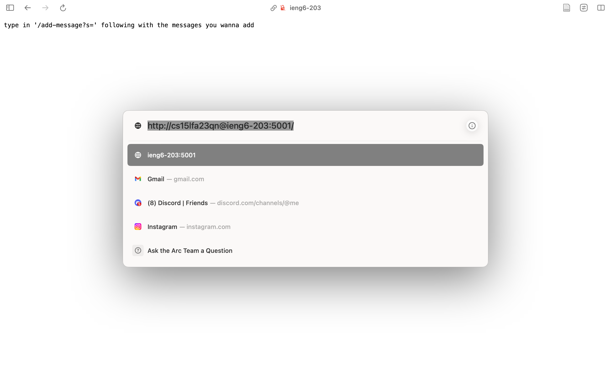
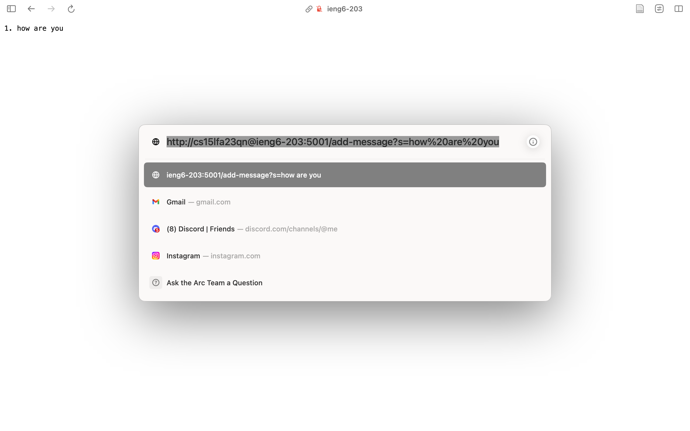
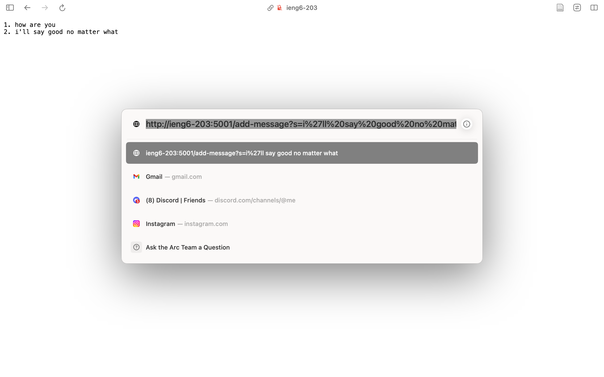
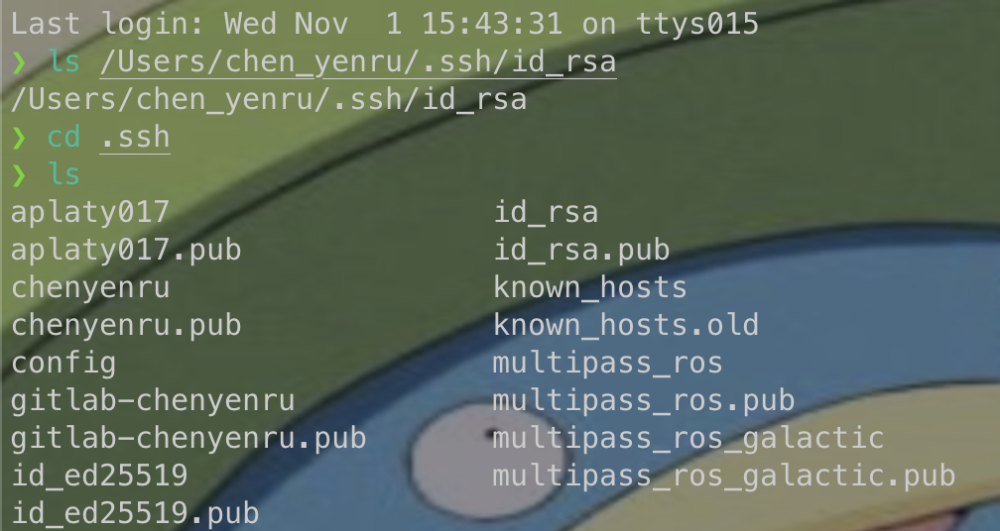
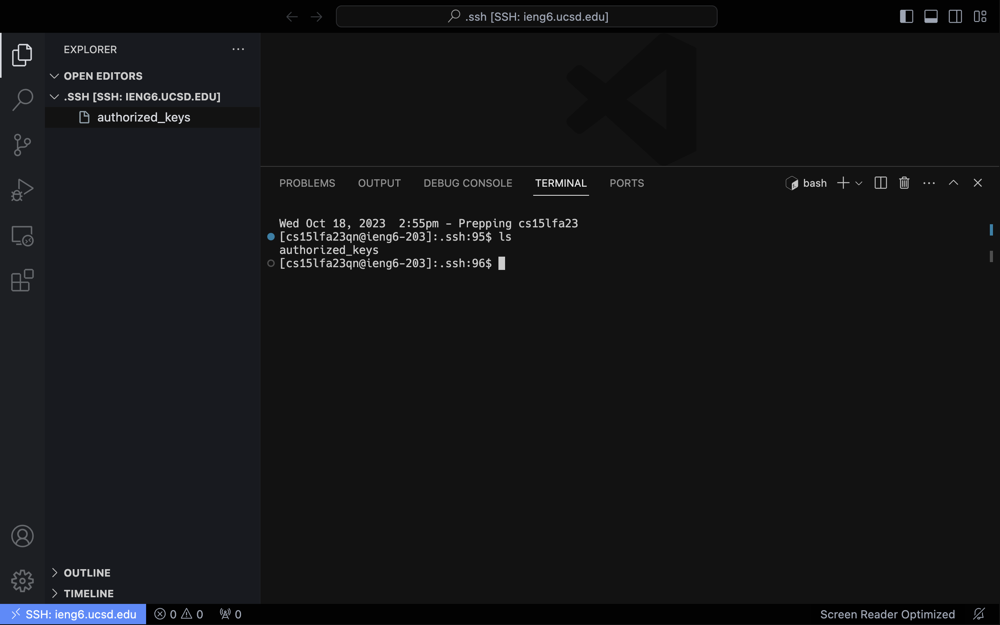

# CSE15L Lab Report 2

## Part 1 Terminal Chatbot 🎣 🐟 🍣

The following is the code I used in the file `StringServer.java`:

```java
import java.io.IOException;
import java.net.URI;
import java.util.ArrayList;

class Handler implements URLHandler {
    // The one bit of state on the server: a number that will be manipulated by
    // various requests.
    int num = 0;
    ArrayList<String> messages = new ArrayList<String>();
    String toReturn = "";

    public String handleRequest(URI url) {
        if (url.getPath().equals("/")) {
            if (messages.size() > 0) {
                return defaultPage();
            } else {
                return "type in '/add-message?s=' following with the messages you wanna add";
            }
            // return String.format("Number: %d. Path: %s", num,
            // "http://ieng6-203.ucsd.edu:2023/");
        } else if (url.getPath().contains("/add-message")) {
            String[] parameters = url.getQuery().split("=");
            if (parameters[0].equals("s")) {
                messages.add(parameters[1]);
                // return String.format("'%s' is now added! There's currently %d messages",
                // parameters[1],
                // messages.size());
            }
            return defaultPage();

        } else {
            return "404 Not Found!";
        }
    }

    private String defaultPage() {
        toReturn = "";
        for (int i = 0; i < messages.size(); ++i) {
            toReturn += String.format("%d. %s \n", i + 1, messages.get(i));
        }
        return toReturn;
    }
}

class StringServer {
    public static void main(String[] args) throws IOException {
        if (args.length == 0) {
            System.out.println("Missing port number! Try any number between 1024 to 49151");
            return;
        }

        int port = Integer.parseInt(args[0]);

        Server.start(port, new Handler());
    }
}

```

This is the default page:


After I used ``


Which methods in your code are called?
What are the relevant arguments to those methods, and the values of any relevant fields of the class?
How do the values of any relevant fields of the class change from this specific request? If no values got changed, explain why.




Which methods in your code are called?
What are the relevant arguments to those methods, and the values of any relevant fields of the class?
How do the values of any relevant fields of the class change from this specific request? If no values got changed, explain why.

## Part 2 ssh interactions 👹
- The path to the private key for your SSH key for logging into ieng6 (on your computer or on the home directory of the lab computer):





## Part 3 What I've Learned 😎
> 🗣️: In a couple of sentences, describe something you learned from lab in week 2 or 3 that you didn’t know before.