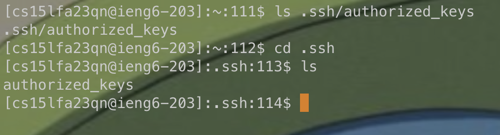

# CSE15L Lab Report 2

## Part 1 Terminal Chatbot 🎣 🐟 🍣

### My `StringServer.java` file and how I hosted the server
In the demo below, I used the port number `5001`. I hosted the server on `http://ieng6-203:5001`.

The following is the code I used in the file `StringServer.java`:

```java
import java.io.IOException;
import java.net.URI;
import java.util.ArrayList;

class Handler implements URLHandler {
    int num = 0;
    ArrayList<String> messages = new ArrayList<String>();
    String toReturn = "";

    public String handleRequest(URI url) {
        if (url.getPath().equals("/")) {
            if (messages.size() > 0) {
                return defaultPage();
            } else {
                return "type in '/add-message?s=' following with the messages you wanna add";
            }
        } else if (url.getPath().contains("/add-message")) {
            String[] parameters = url.getQuery().split("=");
            if (parameters[0].equals("s")) {
                messages.add(parameters[1]);
            }
            return defaultPage();

        } else {
            return "404 Not Found!";
        }
    }

    private String defaultPage() {
        toReturn = "";
        for (int i = 0; i < messages.size(); ++i) {
            toReturn += String.format("%d. %s \n", i + 1, messages.get(i));
        }
        return toReturn;
    }
}

class StringServer {
    public static void main(String[] args) throws IOException {
        if (args.length == 0) {
            System.out.println("Missing port number! Try any number between 1024 to 49151");
            return;
        }

        int port = Integer.parseInt(args[0]);

        Server.start(port, new Handler());
    }
}

```

---

The following is the default page (`http://ieng6-203:5001`):


### `add-message` functionality
#### First Message: "*How are You*"
After I used ``http://ieng6-203:5001/add-message?s=how are you`, the following is returned


> 🗣️: Which methods in your code did you call?

I called the `handleRequest` method, which uses the `defaultPage()` helper function.

> 🗣️: What are the relevant arguments to those methods, and the values of any relevant fields of the class?

When the path `/add-message` is found in the URL, the function get the message that is typed in after the equation mark `=` of `/add-message?=`.

In this case, it's `How are you`, and it's represented as `parameters[1]`.

The code gets the `ArrayList<String>` variable `messages` that store each message as an element. Then, the code adds the new message in `parameters[1]` into `messages`

We can see that in `messages.add(parameters[1]);`

> 🗣️: How do the values of any relevant fields of the class change from this specific request? If no values got changed, explain why.

`messages` were changed because `handleRequest()` added a new String from the query in the `URL url` variable it received.

We can see that in the following segment of the code:
```java
String[] parameters = url.getQuery().split("=");
            if (parameters[0].equals("s")) {
                messages.add(parameters[1]);
```

`messages` were changed because `handleRequest()` added a new String from the query in the `URL url` variable it received.

We can see that in the following segment of the code:
```java
String[] parameters = url.getQuery().split("=");
            if (parameters[0].equals("s")) {
                messages.add(parameters[1]);
```

We can access this added message by calling `messages.get(0)`

### Second message: "*i'll say good no matter what*""


> 🗣️: Which methods in your code did you call?

I called the `handleRequest` method, which uses the `defaultPage()` helper function.

*Note: This is identical to the response for[the first message](#first-message-how-are-you)*

> 🗣️: What are the relevant arguments to those methods, and the values of any relevant fields of the class?

*Please see the explanation for [the first message](#first-message-how-are-you).*

> 🗣️: How do the values of any relevant fields of the class change from this specific request? If no values got changed, explain why.

`messages` has the `String` `"i'll say good no matter what"` added to it's last element, at index `1`, since we have the first message at index `0`

We can access the message by calling `messages.get(1)`


## Part 2 `SSH` interactions 👹
> 🗣️: The path to the private key for your SSH key for logging into ieng6 (on your computer or on the home directory of the lab computer)
> 

> 🗣️: The path to the public key for your SSH key for logging into ieng6 (within your account on ieng6)
> 

> 🗣️: A terminal interaction where you log into ieng6 with your course-specific account without being asked for a password.
> 


## Part 3 What I've Learned 😎
> 🗣️: In a couple of sentences, describe something you learned from lab in week 2 or 3 that you didn’t know before.

- I've never used `SSH` to connect to remote server before, and I think it's really cool that we're able to connect to a remote desktop and off from that regardless of which device we're having. This has already helped me in my work for Triton AI, where I'd need to access the content on a DIY car's computer via `SSH` command. 
- I also never knew that we could use URL and query to interact with servers as we've just did with `add-message`
- Also, I didn't know that we could save the password for connecting to a remote server locally. I will probably try using that for my GitHub `SSH` client! 